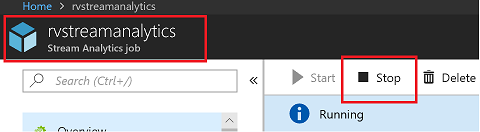
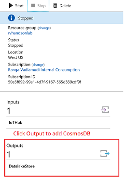
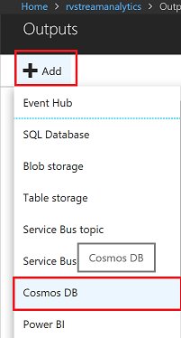
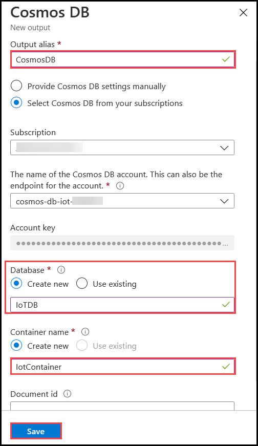
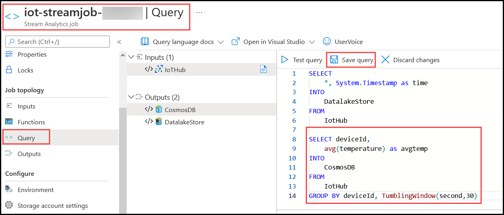
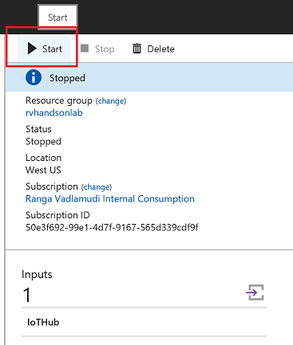
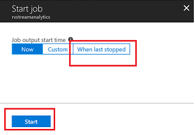
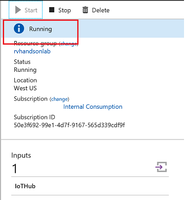
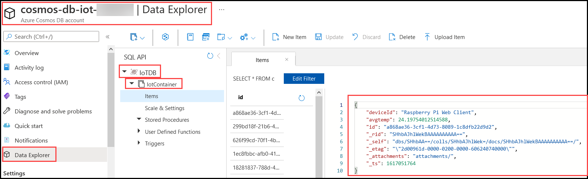

# Hot Path Analytics with CosmosDB and Azure Stream Analytics


Azure Cosmos DB is Microsoft's globally distributed, multi-model database. The atom-record-sequence (ARS) based data model that Azure Cosmos DB is built on natively supports multiple data models, including but not limited to document, graph, key-value, table, and column-family data models


Elastically and independently scale throughput and storage on demand and worldwide

Azure Cosmos DB provides five consistency levels: strong, bounded-staleness, session, consistent prefix, and eventual. 

In this lab you will learn

* streaming analytics with windowing techniques
* to Store Time Series Data in CosmosDB

## Stream Data To Cosmos DB

To Add Cosmos DB as output to Stream Analytics Job you will need to Stop the job, Add Cosmos DB output and corresponding Query and Start the job.

1. Go to **Stream Analytics Job** in *iot* RG in the Azure portal and under *Overview* Page, click on **Stop** as mentioned in the image below.

   

1. Wait till job goes into *Stopped* state. Then click on **Outputs** as shown in the image below.

   

1. Add Cosmos DB as an Output to Stream Analytics Job. In the *Outputs* page, click on **+ Add** and select **Cosmos DB** output sink.

   

1. Provide an **Output Alias**, create a new Database and provide name to **Database Name** and **Container Name** as mentioned in the screenshot below.

   

1. In **Stream Analytics Job** in *iot* RG in the Azure portal and under *Job Topology*, click on **Query** as shown in the image below. Edit the existing query to Add new query to consume data from IoTHub and store data into Cosmos DB and then click on **Save query**.

   ```sql
   SELECT deviceId,
       avg(temperature) as avgtemp
   INTO
       CosmosDB
   FROM
       IotHub
   GROUP BY deviceId, TumblingWindow(second,30)
   ```

   

1. In **Stream Analytics Job** in *iot* RG in the Azure portal and under *Overview* Page, click on **Start** to Start Stream Analytics Job.

   

1. Make sure you stream all the data from when you last stopped the job. Stream Analytics interface provides an option as shown in the image below.

   

1. Make sure Stream Analytics job goes into *Running* mode

   

1. Use Cosmos DB data explorer to view data being streamed from IoTHub to Cosmos DB. In the **Cosmos DB Account** in *iot* RG and click on **Data Explorer** on the left pane and view the data as mentioned in the screenshot below.

   
