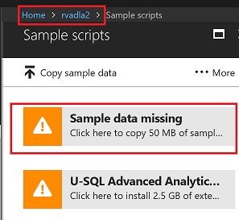
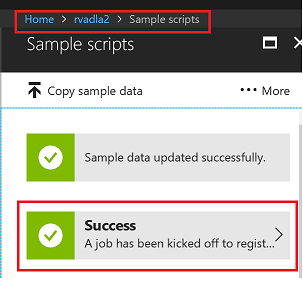
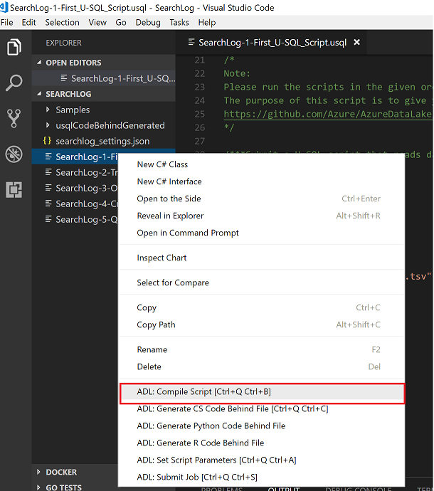
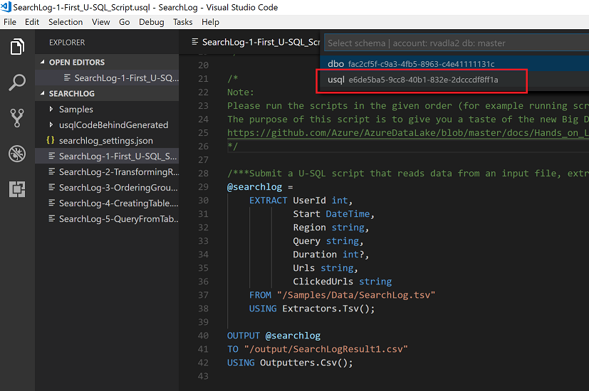
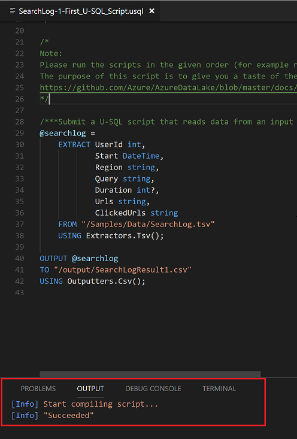
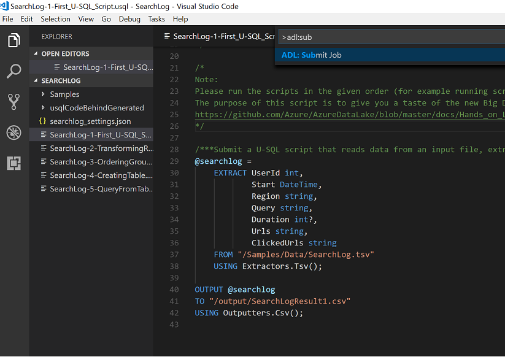
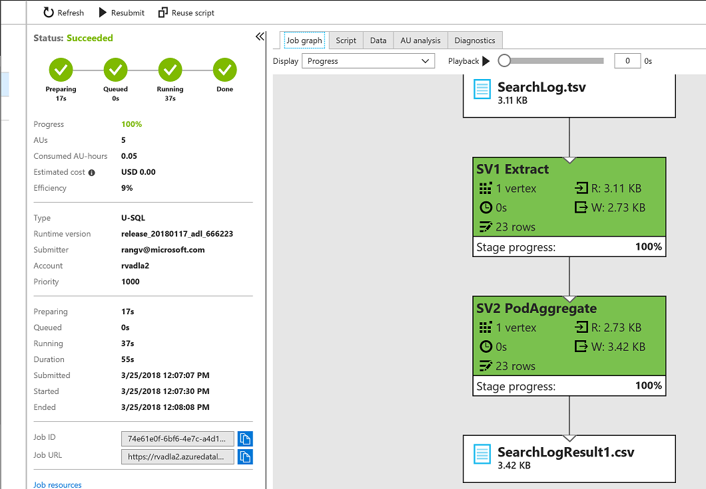
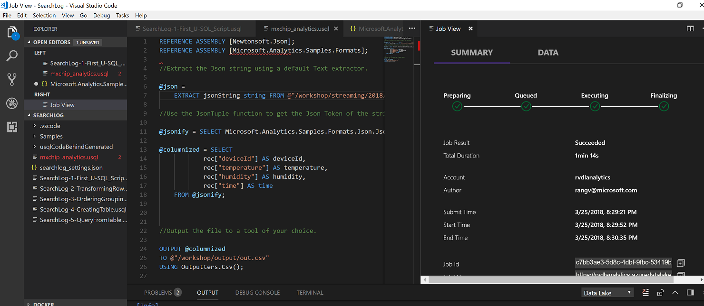

# Batch Analytics

## Batch Analytics with Data Lake Analytics Service


Process big data jobs in seconds with Azure Data Lake Analytics. There is no infrastructure to worry about because there are no servers, virtual machines, or clusters to wait for, manage, or tune. Instantly scale the processing power, measured in Azure Data Lake Analytics Units (AU), from one to thousands for each job. You only pay for the processing that you use per job.

U-SQL is a simple, expressive, and extensible language that allows you to write code once and have it automatically parallelized for the scale you need. Process petabytes of data for diverse workload categories such as querying, ETL, analytics, machine learning, machine translation, image processing, and sentiment analysis by leveraging existing libraries written in .NET languages, R, or Python.

In this lab learn how to 

* use Data Lake Analytics to run big data analysis jobs that scale to massive data sets
* how to create and manage batch, real-time, and interactive analytics jobs, and 
* how to query using the U-SQL language

## Create Sample Data and Install Extensions

1. In the Azure portal navigate to the IoT resource group select **Data Lake Analytics** resource and click on **Sample scripts** under *Overview*.

   

1. Click on **Sample data missing** button to create sample data in Data lake Storage.

   

1. You should see successful message after data is copied

   

1. To install Extensions, click on **U-SQL Advanced Analytics extensions available** as shown in the image below.

   

1. This should take less than 5 minutes to install. Once installed you should see successful Extension installation

   


## Visual Studio Code Integration

1. Open VS Code from by clicking on the *VS Code* icon on your JumpVM Deskop. Once you open the VS Code, click on the Extensions icon on the left bar and search for **Azure Data Lake Tool** as shown in the screenshot below. Click on **Install** to Install VS Code Extension for Data Lake Analytics.

   

### Run Samples

Run Samples to learn Data Lake Analytics

1. Press ***ctrl+shift+P*** to get the search bar on the top and search for the **>ADL:** and click on **ADL: Start U-SQL scripting** from the the search results. You might need to login to your Azure Accounr with the credentials provided in the lab *Environment Details* tab.

   

1. Once the script is downloaded, open folder *C:\Users\demouser\.vscode\extensions\usqlextpublisher.usql-vscode-ext-0.2.15\examples\sample_scripts\SearchLog*. Once the folder *SearchLog* is opened in VS Code, from the *Editor pane* open **SearchLog-1-First_U-SQL_Script.usql** file as shown below.

   

1. To *Compile Script*, right-click on the script from the Editor pane and click on **ADL: Compile Script**.

   

1. Click on **List more accounts**

   

1. Now from the options listed below, select your **Data Lake Analytics Account**

   

1. Select *master key*

   

1. Compile as *USQL*

   

1. USQL script should be compiled and in the *OUTPUT* Section should show the following message.

   

1. Now to *Submit Job* to Run, press ***ctrl+shift+P*** and search for the **>adl: sub** and click on **ADL: Submit Job** from the the search results.

   

1. As you performed in the steps above select your **Data Lake Analytics Account**, *master key* and *USQL* as schema. Now the Job Submission starts. Default priority is 1000 and number default number of nodes to run the script are 5.

   

1. Go to **Data Lake Analytics** resource in the *iot* resource group in the Azure Portal and click on **View all jobs** in the *Overview* page.

   

1. In the list of all jobs, click on **SearchLog-1-First_U-SQL_Script**.

   

1. Now you can view the Job Success with Job Analytics.

   

1. Open the **Data Lake Storage Gen1** in *iot* RG in the Azure portal and in the *Overview* page click on **Data Explorer**.

1. In the *Data Explorer* to view the Input File, go to ***Samples\Data\SearchLog.tsv*** as shown in the image below
   
   

   

1. In the *Data Explorer* to view the Output File, go to ***output\SearchLogResult1.csv*** as shown in the image below.

   

   

## Create an Analytics Job against MXChip Data to convert JSON to CSV using U-SQL and Data Lake Analytics

#### Create a new mxchip_analytics.usql file in the project

1. Open VS Code and create a new file by right-clicking on the *Editor pane* and selecting New File. Name it ***mxchip_analytics.usql***. Copy and paste the code below in the file you created now and save it.

   ```sql
   REFERENCE ASSEMBLY [Newtonsoft.Json];
   REFERENCE ASSEMBLY [Microsoft.Analytics.Samples.Formats]; 

   //Extract the Json string using a default Text extractor. 

   @json = 
       EXTRACT jsonString string FROM @"/workshop/streaming/2018/03/{*}/{*}.json" USING Extractors.Tsv(quoting:false);

   //Use the JsonTuple function to get the Json Token of the string so it can be parsed later with Json .NET functions

   @jsonify = SELECT Microsoft.Analytics.Samples.Formats.Json.JsonFunctions.JsonTuple(jsonString) AS rec FROM @json;

   @columnized = SELECT 
               rec["deviceId"] AS deviceId,
               rec["temperature"] AS temperature,
               rec["humidity"] AS humidity,
               rec["time"] AS time
       FROM @jsonify;

   //Output the file to a tool of your choice.

   OUTPUT @columnized
   TO @"/workshop/output/out.csv"
   USING Outputters.Csv();
   ```

1. Register two assemblies Newtonsoft and Samples.formats. Download the dlls from /libs folder and register

   

1. Select the dlls from the /libs folder

   

### Submit Job

1. Submit Job to convert all JSON files to CSV files

   

1. View Jobs

   
