# Cold Path Storage

## Data Lake Store and Stream Data from IoTHub using Azure Stream Analytics

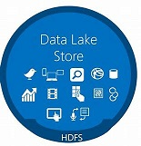

Azure Data Lake Store is an enterprise-wide hyper-scale repository for big data analytic workloads. Azure Data Lake enables you to capture data of any size, type, and ingestion speed in one single place for operational and exploratory analytics. Data Lake Store can store trillions of files. A single file can be larger than one petabyte in size. This makes Data Lake Store ideal for storing any type of data including massive datasets like high-resolution video, genomic and seismic datasets, medical data, and data from a wide variety of industries.

## Explore Data in Data Lake Store

* Open the **Data Lake Store** in *iot* RG in the Azure portal and in the *Overview* page click on **Data Explorer**.

   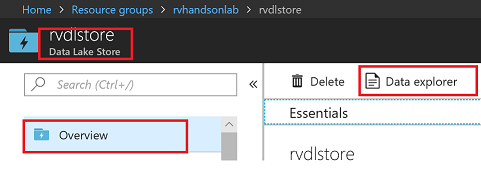

### Create Folders in Data Lake Store

Create \workshop\streaming folder to store Streaming data coming from your device through IoTHub using Stream Analytics Job

1. In the data explorer, click on **New folder** and create **\workshop** folder. Now you can see a folder named **workshop** is created in the Data lake storage.

   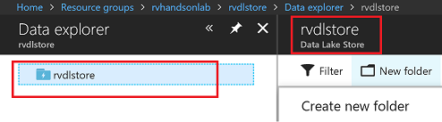

1. Click on the *workshop* folder, click on **New folder** and create **streaming** folder under folder *workshop*.

   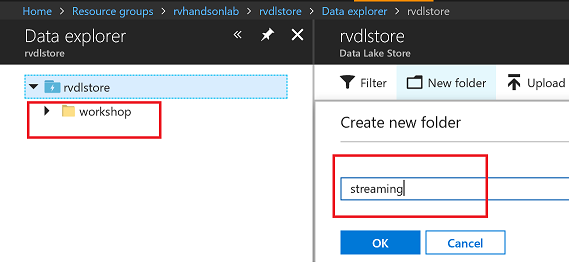

1. You should have the folder structure below in place to start streaming data to data lake store.

   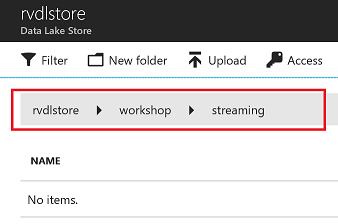

## Azure Stream Analytics Job

Azure Stream Analytics is a managed event-processing engine set up real-time analytic computations on streaming data. The data can come from devices, sensors, web sites, social media feeds, applications, infrastructure systems, and more.

1. Go to your IoTHub in *iot* RG in the Azure portal, on the left pane under *Settings* select **Build-in endpoints** and scroll down to *Consumer Groups*. Enter a Consumer Group name in the column to create one as mentioned in the image below.

   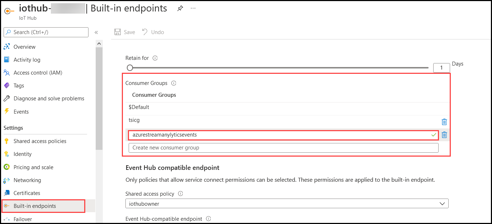

1. Go to your **Stream Analytics Job** in *iot* RG in the Azure portal and click on **Inputs** as shown in the image below.

   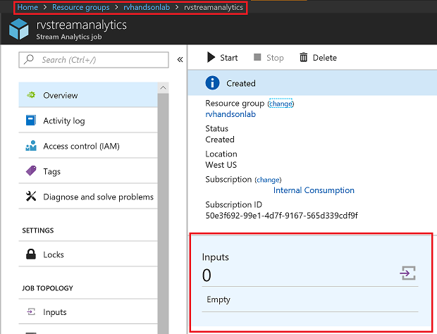

1. In the *Inputs* page, click on **+ Add Stream input** and select **IoT Hub** as Input.

   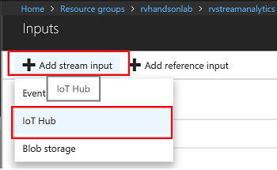

1. Provide an **Input Alias** and select the **Consumer Group** you created in the previous steps. Make sure to provide a consumer group. Each consumer group allows up to 5 output sinks/consumers. Make sure you create a new consumer group for every 5 output sinks and you can create up to 32 consumer groups.

   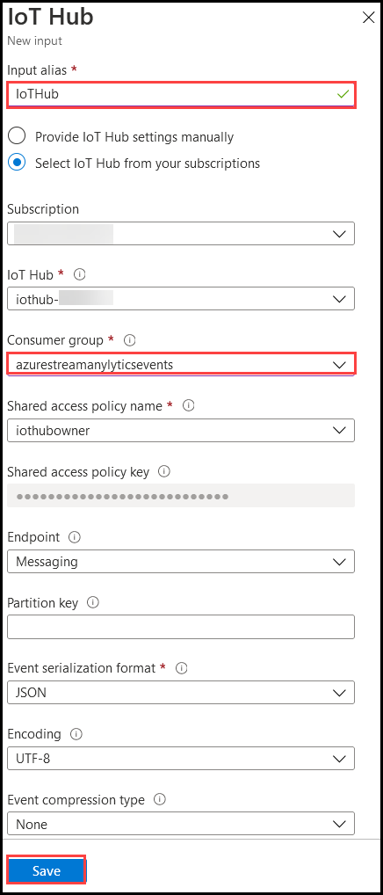

1. Go back your **Stream Analytics Job** in *iot* RG in the Azure portal and click on **Outputs** as shown in the image below. 

   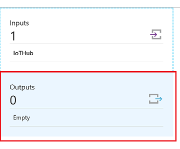

1. Add Data Lake Store as Output for Streaming Job. In the *Outputs* page, click on **+ Add** and select **Data Lake Store** output sink.

   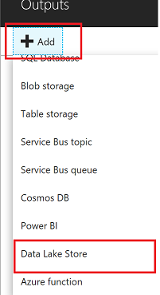

1. Provide an **Output Alias** and select the Data Lake Store account provided to you. Under *Path prefix pattern*, provide folder structure to stream data to the store **/workshop/streaming/{date}/{time}** with Date=YYYY/MM/DD format and Time=HH format will equate to /workshop/streaming/2018/03/30/11 on the store. Select *Authentication mode* as **User Token** and click on **Authorize**.

   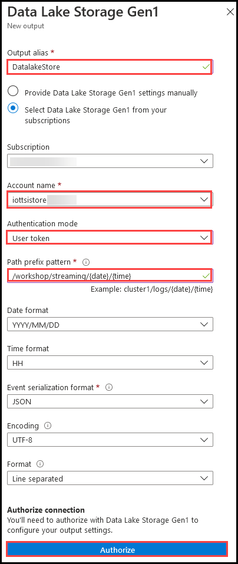

1. You will have to Authorize data lake store connection for Stream analytics to have access to be able to write to data lake store

   - Multi-factor authentication based on OAuth2.0
   - Integration with on-premises AD for federated authentication
   - Role-based access control
   - Privileged account management
   - Application usage monitoring and rich auditing
   - Security monitoring and alerting
   - Fine-grained ACLs for AD identities

   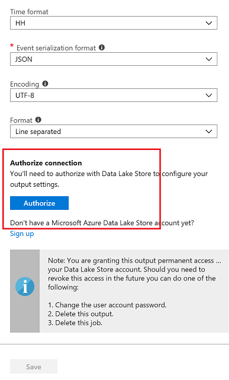

1. You will see a pop-up and once the pop-up closes Authorize button will be greyed out after azuthorization is complete. Now you can click on **Save**.

   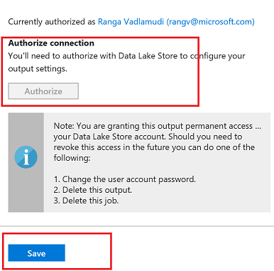

### Edit Stream Analytics Query

1. In **Stream Analytics Job** in *iot* RG in the Azure portal and under *Job Topology*, click on **Query** as shown in the image below. Copy and paste the below mentioned query and click on **Save query**.

   ```sql
   SELECT
       *, System.Timestamp as time
   INTO
       DatalakeStore
   FROM
       IotHub
   ```

   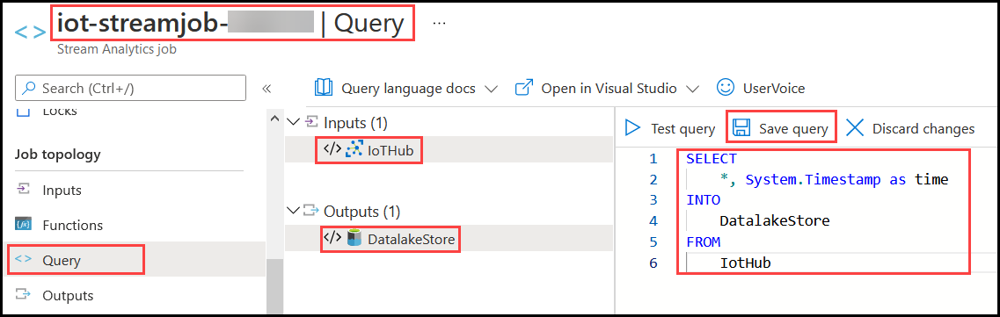

### Start Streaming Analytics Job

1. Start the stream job which will read data from IoTHub and store data in Data lake Store. In **Stream Analytics Job** in *iot* RG in the Azure portal and under *Overview* Page, click on **Start**

   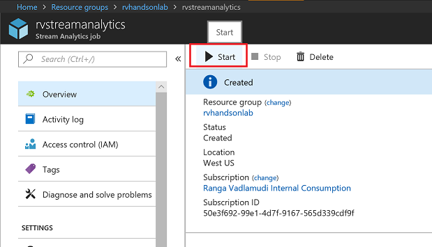

1. You can pick custom time to go back a few hours to pick up data from when your device has started streaming.

   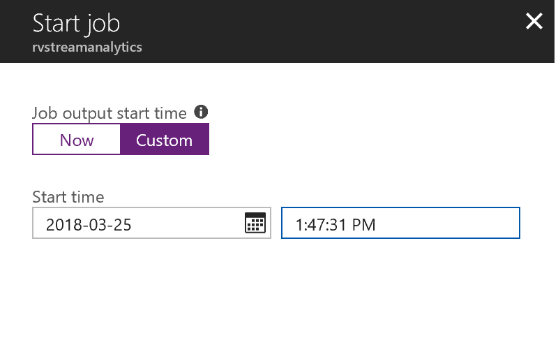

1. Wait till job goes into running state. If you see any errors it could be from your query, make sure the syntax is correct.

   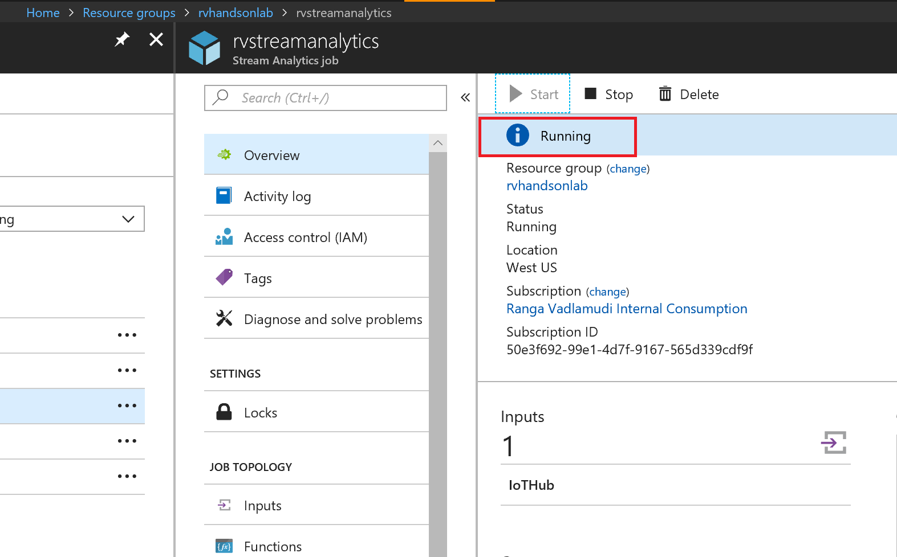

### Explore Streaming Data

1. Go to Data Lake store data explorer and drill down to /workshop/streaming folder.You will see folders created with YYYY/MM/DD/HH format. 

   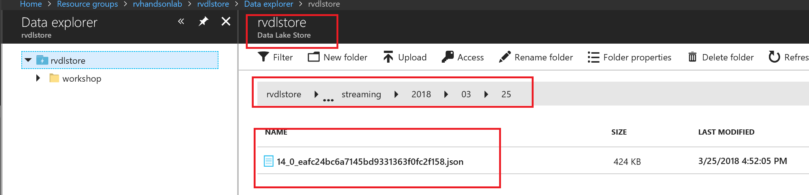

1. You will see json files, with one file per hour, you can explore the data.

   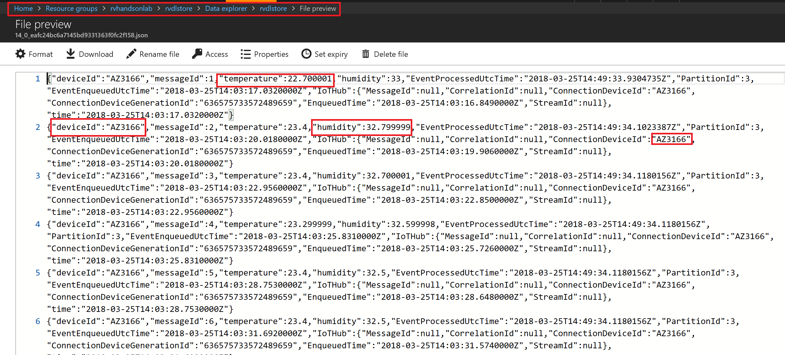
