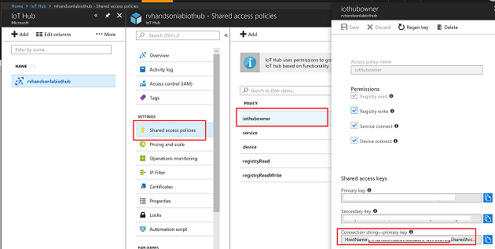
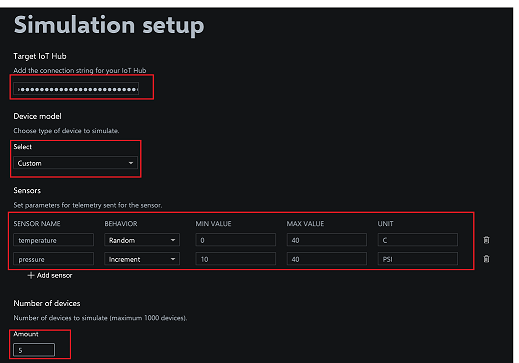
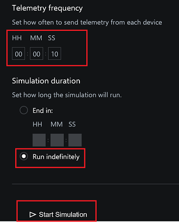
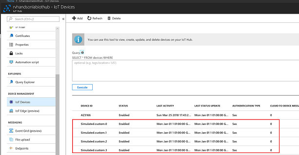

# Load test with Device Simulator

Learn how to set up a Device Simulator using Azure IoT Suite and Connect to IoTHub

## Create Device Simulator

1. Open parameters.json file in the **Visual Studio code** from the following path. 
   ```
   Path:
   
   C:\azure-iot-pcs-device-simulation\azure-iot-pcs-device-simulation-master\deployment\armtemplate
 
   ```
2. Now replace the parameters.json file as mentioned below:
      
      deploymentRegion: eastus
      aadTenantId: need to copy it from the Lab guide **Environment Details** 
      subscriptionId: need to copy it from the Lab guide **Environment Details**
      solutionName: this need to be a unique string in addition with the **Deployment ID** 
            i.e Deployment ID is provided in the Lab guide **Environment Details**
      adminUsername: User should provide A random unique name for the Virtual MAchine.
      adminPassword: User should provide A Password for the Virtual MAchine.
  
  
  * The chance of deploynment failure is high when a proper unique name is not assigned to **SolutionName**

3. Then save the parameters.json file.
4. Now Open Command Prompt as **Run as Administrator** and navigate to deployment file.

```
cd C:\azure-iot-pcs-device-simulation\azure-iot-pcs-device-simulation-master\deployment

```
5. Now install the device simulator with the commmands below:
    
    ```
    npm install
    
    npm run deploy
    
    ```
* Then the script starts running and it might ask you to login multiple times. Please login when required as mentioned in the prompt.
* The installation process might take approximately 10 min.

6. Once the deployment succeeds, you will be presented with a URL to access the Simulation UI.


7. A new resource group with a IoTHub resource in it. 


## Stream Data to IoTHub

Get connection string of IoT Hub



Setup simulation with sensors and number of devices



Select the frequency of data flowing into IoT Hub 



## New Devices Created in IoTHub


