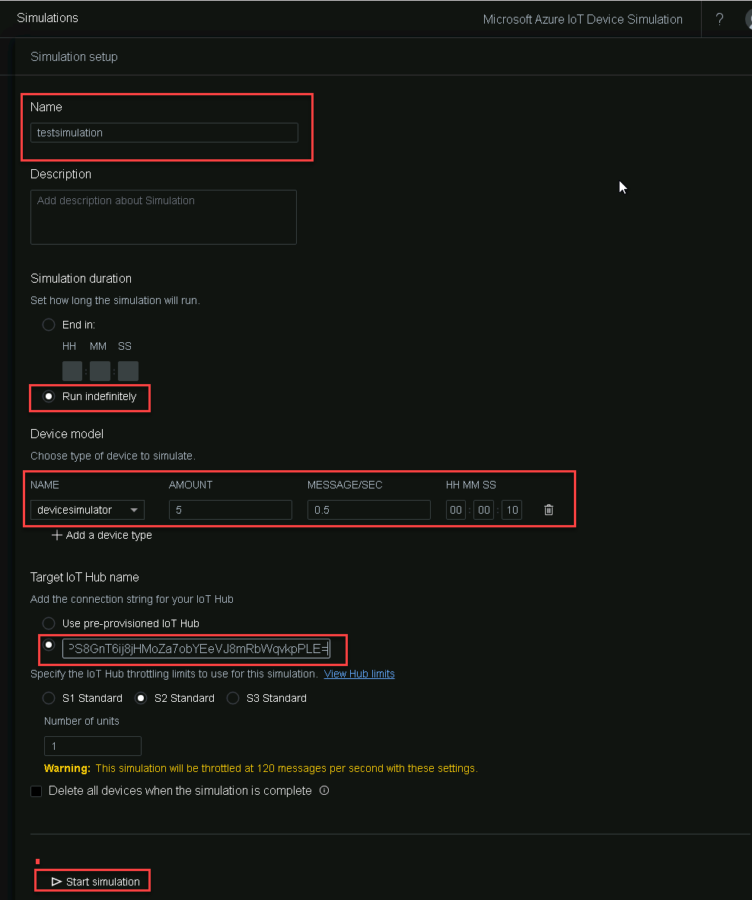

# Load test with Device Simulator

Learn how to set up a Device Simulator using Azure IoT Suite and Connect to IoTHub

## Create Device Simulator

1. Open parameters.json file in the **Visual Studio code** from the following path : *C:\azure-iot-pcs-device-simulation\azure-iot-pcs-device-simulation-master\deployment\armtemplate*

2. Now replace the parameters.json file as mentioned below:
      
   * **deploymentRegion**: eastus2
   * **aadTenantId**: Copy from the Lab **Environment Details** tab
   * **subscriptionId**: Copy from the Lab **Environment Details** tab
   * **solutionName**: Enter a short unique string and append it with the **Deployment ID** which can be fetched from the Lab **Environment Details** tab
   * **adminUsername**: Provide a username for Virtual Machine.
   * **adminPassword**: Provide a password for Virtual Machine.
  
   > **Note** : Pleae make sure you are providing a unique string for the *solutionName* parameter or else the deployment will fail.
      

3. Save the parameters.json file.

4. Now Open Command Prompt as **Run as Administrator** and navigate to deployment file.

   ```
   cd C:\azure-iot-pcs-device-simulation\azure-iot-pcs-device-simulation-master\deployment

   ```
5. Now run the following commands to deploy the device simulator in your subscription.

   ```
   npm install
   ```

   ```
   npm run deploy
   ```
   

   Then the script starts running and it might ask you to login multiple times. Please login whenever required as mentioned in the prompt.
      
   

   

   

   The deployment will take approximately 10 minutes to succeed.

   

6. Once the deployment succeeds, you will be presented with a URL to access the *Simulation UI*. Copy this Simulation UI for future purpose.

   

7. In the *Azure Portal*, a new resource group with a *solutionName* you provided in the parameter file will be created. You can see that all the required resources for the Device Simulator will be created in this Resource Group. This RG also has an IoTHub deployed in it as shown in the image below. You will be using the resources in this RG for this Module.
   
   

## Stream Data to IoTHub

1. Open the IotHub resource deployed in the new RG created in the previous exercise. Under *Settings* in the left pane, click on **Shared access policies** and click on **iothubowner** under the policy as shown in the image below. Copy the **Connection string- primary key**

   

1. Open the Device Simulation portal using the *Simulation UI* you received at the end of the last exercise. Click on **Device Models** from the left pane and click on **+ Add Device Models** as mentioned in the screenshot below.

   

1. Now let us add devices. Under the Basic tab provide a name to the **Device Model** amd click on **+ Add data point**. Add the **temperature** and **pressure** Data point with corresponding parameters as mentioned below in the image and click on **Save**.

   

1. Now click on the **Simulations** from the left pane and click on **+ New Simulation** as mentioned in the screenshot below.
 
   

1. In the *Simulation setup* page, provide a **Simulation Name**, simulation duration as **Run indefinitely** and click on **+ Add a device type**. Select the **Device Model** that you created in the previous steps, enter amount as **5**, verify that Message/Sec is **0.5** and *HH:MM:SS* is **00:00:10**. This is set the frequency of data flowing into IoT Hub. Now click on **Start simulation** to start the simulation.

   

1. Now you can see that the test Simulation is running.

## New Devices Created in IoTHub

1. To check the new device created, go to the IotHub resource deployed in the new RG. Under *Explorers* in the left pane, click on **IoT devices** and scroll down to view the devices.


