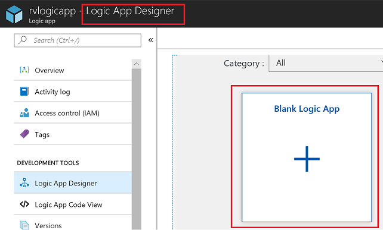
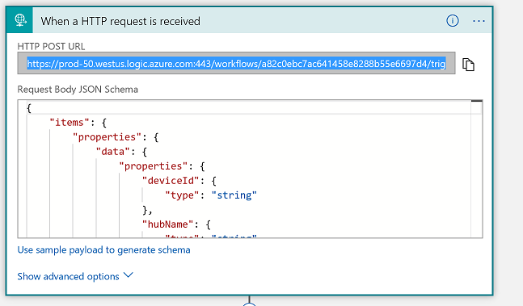
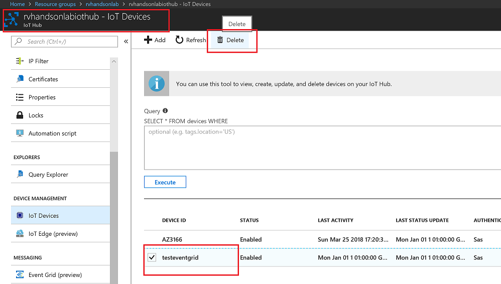

# React to Critical Device Lifecycle Events and Trigger Actions


Azure IoT Hub integrates with Azure Event Grid so that you can send event notifications to other services and trigger downstream processes. Configure your business applications to listen for IoT Hub events so that you can react to critical events in a reliable, scalable, and secure manner. For example, build an application to perform multiple actions like updating a database, creating a ticket, and delivering an email notification every time a new IoT device is registered to your IoT hub.

In this lab you will learn how to

* Create Event Grid

* Connect IoT Hub to Event Grid

## Create New App using Logic App Designer

1. Go to **Logic App** in *iot* RG in the Azure portal and on the left pane select **Logic app designer**. Scroll down and select the **Blank Logic App** template.

   

1. Search for *http* and Select HTTP Request as mentioned below.

   

1. Click on **Use sample payload to generate schema**, then update and provide the Sample Payload mentioned below

   * **Subscription ID**: Copy from the Lab **Environment Details** tab
   * **Resource group name**: Copy from the Lab **Environment Details** tab
   * **IoT hub name**: Copy from the **iot Resource group**

   

   ```
   [{
     "id": "56afc886-767b-d359-d59e-0da7877166b2",
     "topic": "/SUBSCRIPTIONS/<Subscription ID>/RESOURCEGROUPS/<Resource group name>/PROVIDERS/MICROSOFT.DEVICES/IOTHUBS/<IoT hub name>",
     "subject": "devices/LogicAppTestDevice",
     "eventType": "Microsoft.Devices.DeviceCreated",
     "eventTime": "2018-01-02T19:17:44.4383997Z",
     "data": {
       "twin": {
         "deviceId": "LogicAppTestDevice",
         "etag": "AAAAAAAAAAE=",
         "status": "enabled",
         "statusUpdateTime": "0001-01-01T00:00:00",
         "connectionState": "Disconnected",
         "lastActivityTime": "0001-01-01T00:00:00",
         "cloudToDeviceMessageCount": 0,
         "authenticationType": "sas",
         "x509Thumbprint": {
           "primaryThumbprint": null,
           "secondaryThumbprint": null
         },
         "version": 2,
         "properties": {
           "desired": {
             "$metadata": {
               "$lastUpdated": "2018-01-02T19:17:44.4383997Z"
             },
             "$version": 1
           },
           "reported": {
             "$metadata": {
               "$lastUpdated": "2018-01-02T19:17:44.4383997Z"
             },
             "$version": 1
           }
         }
       },
       "hubName": "egtesthub1",
       "deviceId": "LogicAppTestDevice",
       "operationTimestamp": "2018-01-02T19:17:44.4383997Z",
       "opType": "DeviceCreated"
     },
     "dataVersion": "",
     "metadataVersion": "1"
   }]
   ```

## Setup Notification by Sending Email 

1. Click on **New Step** as mentioned below.

   

1. Search *mail* and select **Office 365 Outlook**.

   

   > ***Note*** - You can also use your Gmail account for this Module for testing.

1. Under Actions, select **Send an email (V2)** as shown below.

   

1. **Sign in** to email. You can use your Azure crendentials which you can fetch from lab *Environment Details* tab.

   

1. Create Email template as shown below. In the *To* column, enter your email address that you recieved for the lab. Enter the subject and the Email Body as mentioned below. Use Dynamic content wherever mentioned in the image below.

   

1. Now **Save** the template so that the URL is generated.

   

1. Copy the **HTTP Post URL** that got genenrated. You can find it under *When a HTTP request is received*.

   

## Integrate With IoTHub via Event Grid

1. Go to your IoT Hub in the Azure portal and click on **Events** in the left pane.

   

1. Click on Event Subscription.

   

1. In the *Basic* blade under *Create Event Subscription* page, enter the following details.

   - **Name** - Provide a name to the event like the one mentioned in the image below
   - **Event Schema** - Select *Event Grid Schema*
   - **System Topic Name** - Provide a name to the topic to which the events will be published
   - **Endpoint Type** - Select *Web Hook*
   - **Endpoint** - Provide the **HTTP Post URL** from previous steps
   
   Leave the rest as default as mentioned in the image below and click on **Create**.

   

## Add Device and Test Notification

1. Go to your IoT Hub in the Azure portal, on the left pane under *Device Management* select **IoT Devices** and click on **+ Add**.

   

1. Provide a name to the device as mentioned below and click **Save** button to create a new device.

   

1. You should get an email notification similarly.

   

## Delete Device and Test Notification

1. Go to your IoT Hub in the Azure portal, on the left pane under *Device Management* select **IoT Devices** and select the device you created in previous step -> Delete

   

1. You Should get an email notification

   
