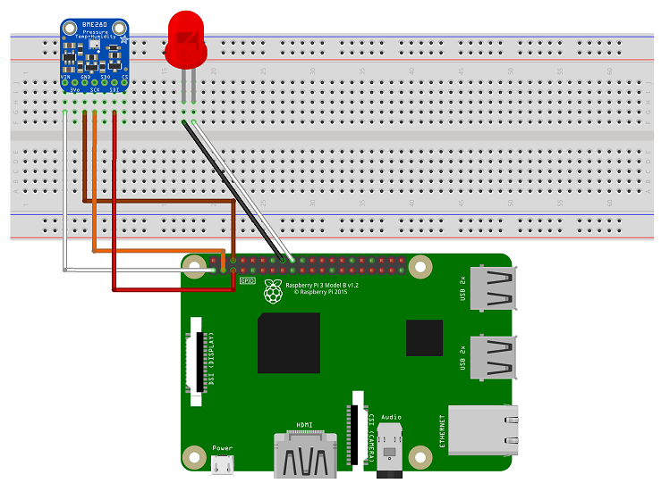
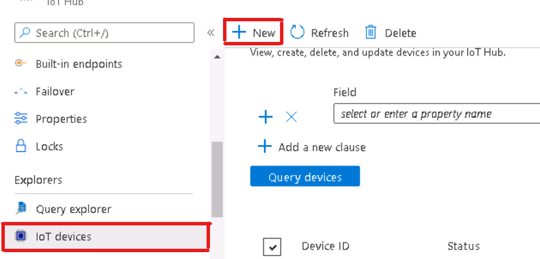
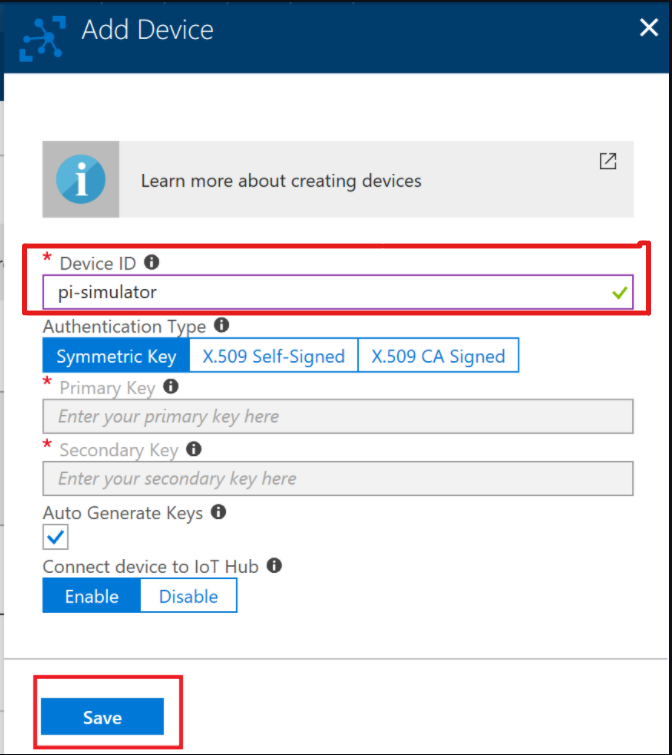
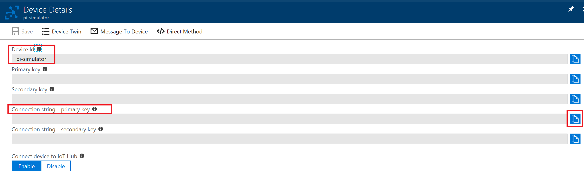
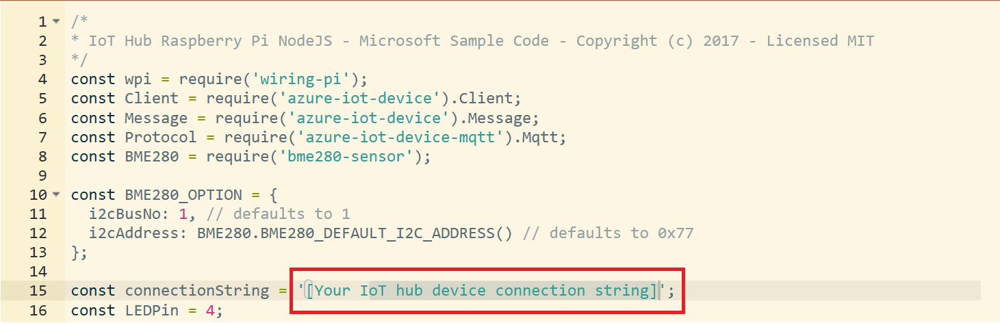
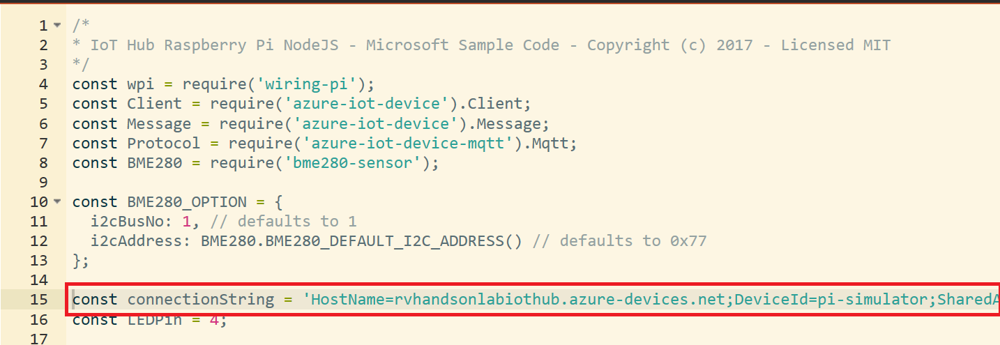
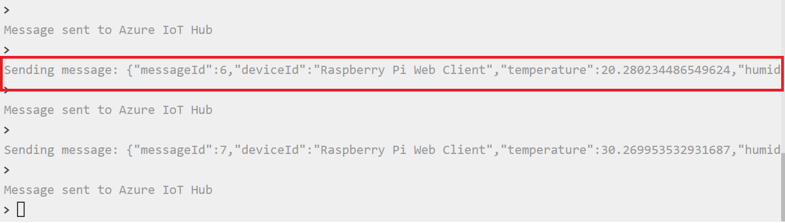
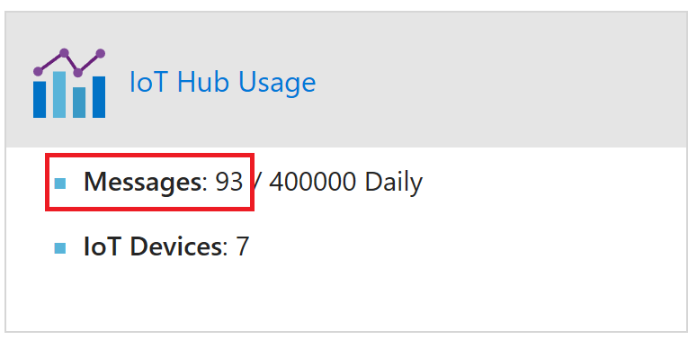

# Connect PI Simulator to IoT Hub

Connect a Simulator to your IoT Hub and stream data. 

### In this lab you will

* Learn to create a device using Azure Portal

* Connect the simulator to IoT Hub

* Send telemetry data to Azure

## Create a Device

1. Go to your IoT Hub in the Azure portal, click on **IoT devices** and Click on **+ NEW**

   

1. Enter a **Device ID** as **pi-simulator** and click **Save**. 

   

1. Click on the device and copy the Primary Connection String. 

   

1. Click on the Pi Simulator icon on the JumpVm desktop.  

1. Replace the connection string with the Primary Connection String copied in the previous step.

   

1. After you copy the connection string, it should look like below.

   

1. Click Run and start sending messages. LED will start blinking.

   

1. Messages will start flowing into IoT Hub

   

> **In the next module you can Visualize the Data flowing into IoT Hub**
