# Visualize Time Series Data with Azure Time Series Insights

## Time Series Insights

Azure Time Series Insights is a fully managed analytics, storage, and visualization service for managing IoT-scale time-series data in the cloud. It provides massively scalable time-series data storage and enables you to explore and analyze billions of events streaming in from all over the world in seconds. Use Time Series Insights to store and manage terabytes of time-series data, explore and visualize billions of events simultaneously, conduct root-cause analysis, and to compare multiple sites and assets.

Time Series Insights has four key jobs:

* First, it's fully integrated with cloud gateways like Azure IoT Hub and Azure Event Hubs. It easily connects to these event sources and parses JSON from messages and structures that have data in clean rows and columns. It joins metadata with telemetry and indexes your data in a columnar store.
* Second, Time Series Insights manages the storage of your data. To ensure data is always easily accessible, it stores your data in memory and SSD’s for up to 400 days. You can interactively query billions of events in seconds – on demand.
* Third, Time Series Insights provides out-of-the-box visualization via the TSI explorer. 
* Fourth, Time Series Insights provides a query service, both in the TSI explorer and by using APIs that are easy to integrate for embedding your time series data into custom applications.

In this lab you will learn to

* explore
* analyze time series data of your IoT solutions or connected things

### Setup Time Series Insights

Go To Time Series Insights in *iot* RG in the Azure portal. On the overview page, click on Go To TSI Explorer which will take you to Time Series Insights Explorer

If you get Data Access Policy Error execute the following steps

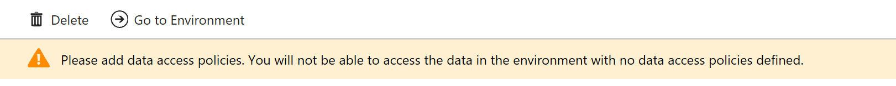

Go To Environment Topology and 

Click on Add Button

Select Contributor Role

Select User

### Time Series Insights Explorer

1. Go To Time Series Insights Explorer

   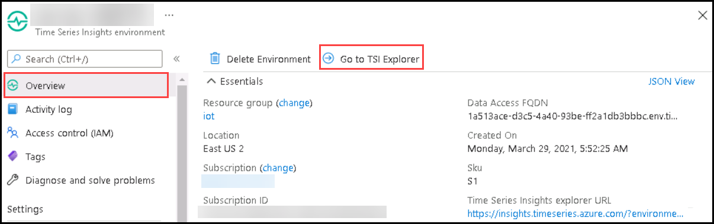

1. In the TSI explorer, click on **Add new query**. Under the *Split By* select **iothub-connection-device-id**. You will see data flowing from two devices. MXChip and Pi Simulator. 

   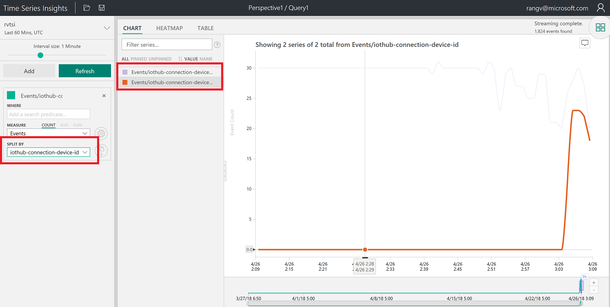

1. Under *Measure* Select **humidity** and under *Split By* option select **iothub-connection-device-id**. You will see data flowing from two devices. MXChip and Pi Simulator.

   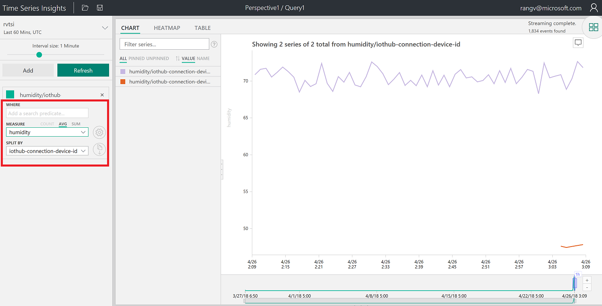

1. Click on the **More actions** and select **Explore raw events**. You can download events in CSV and JSON format by clicking on **CSV or JSON** buttons

   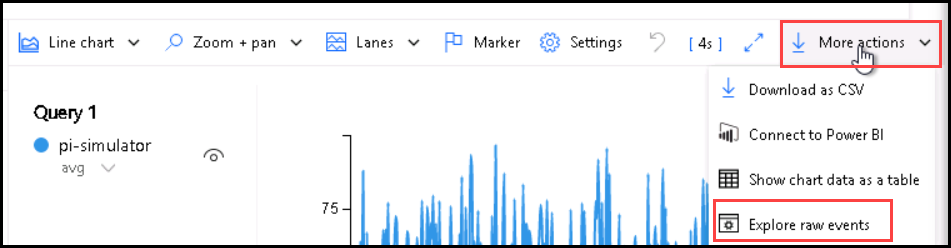

   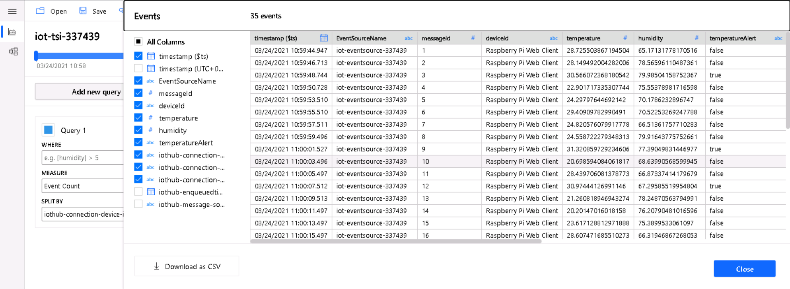

1. Click on **Add new query**.

   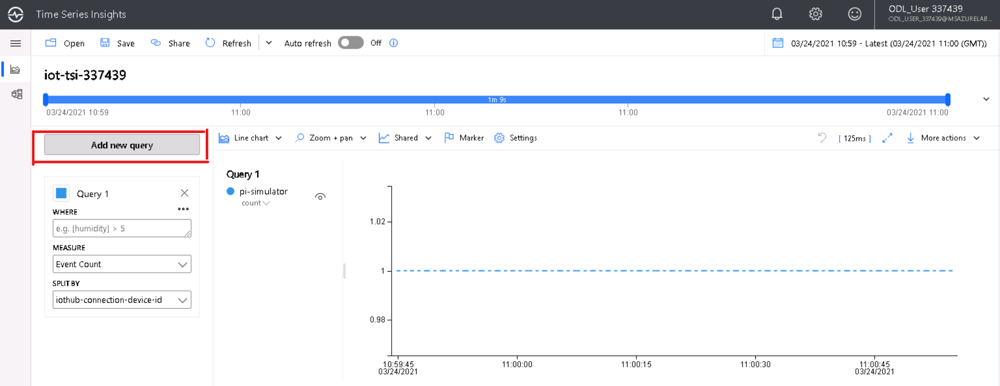

1. Under *Measure* Select **Temperature** and under *Split By* option select **Device ID**.

   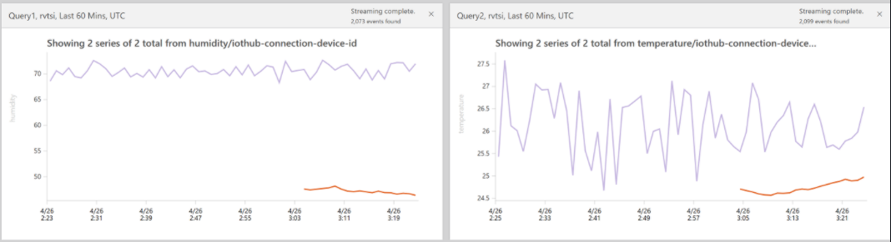

1. Create a chart by selecting a timeframe with drag feature

   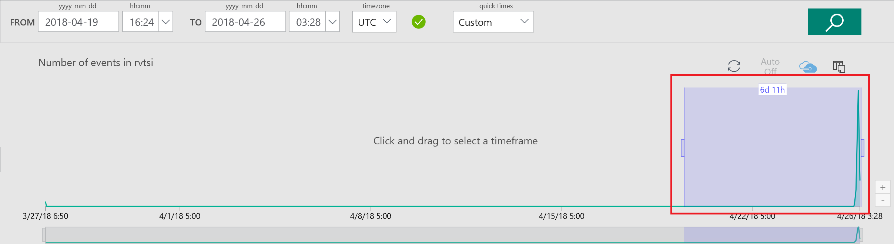

1. Create a Chart by adding a predicate.

   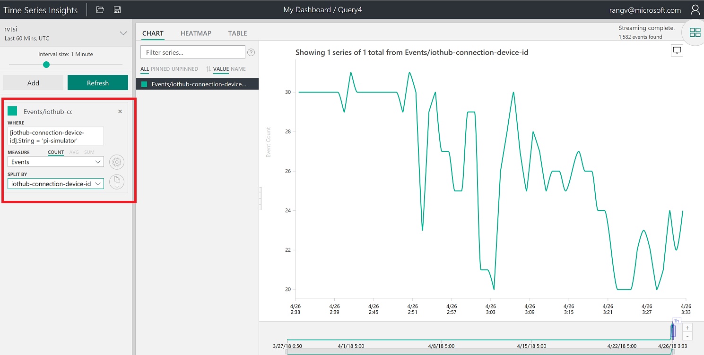

1. Click on Heatmap

   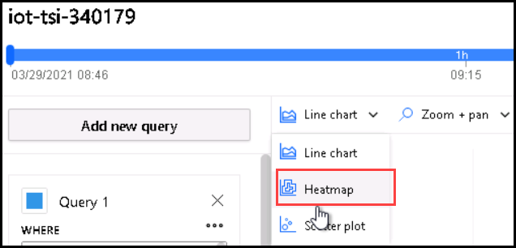
